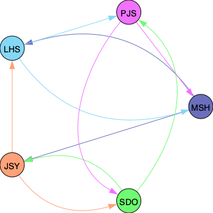

# Problem Solved
Problem Solving Study Group

📌 **Currently Week 17**

😎 **Current Manager**: MSH

## Problems This Week

  - LeetCode 63
    - [Go To Website](https://leetcode.com/problems/unique-paths-ii/)
    - [Go To Directory](./LeetCode/63_Unique_Paths_II/README.md)

  - LeetCode 662
    - [Go To Website](https://leetcode.com/problems/maximum-width-of-binary-tree/)
    - [Go To Directory](./LeetCode/662_Maximum_Width_of_Binary_Tree/README.md)

## Reviewer-Reviewee

### Week 17 ~ 18 [Current]

### Week 15 ~ 16 [Last Week]

[*Instructions for creating review graph*](https://github.com/sunhongmin225/problem-solved/blob/main/utils/README.md)

## Members
* [@sunhongmin225](https://github.com/sunhongmin225)
* [@soleee99](https://github.com/soleee99)
* [@donny-son](https://github.com/donny-son)
* [@hyuns-lee](https://github.com/hyuns-lee)
* [@ttoru96](https://github.com/ttoru96)

## What We Do
* Solve 2 ~ 3 problems every week using various algorithms.
* Review each other's solutions and provide necessary feedback.
* Study and discuss crucial, frequently used, and advanced algorithms.

## How It Works
1. Choose a manager every two weeks.
1. For each week:
	1. The manager uploads 2 ~ 3 problems (without specifying problem types).
	1. Everyone solves problems for one week and adds solutions.
	1. The manager adds problems' types.
	1. Everyone posts reviews of at least two other members' solutions.
1. After two weeks, the manager holds a wrap-up meeting to review and discuss past problems.

## Websites Used for Problems
* [BOJ](https://www.acmicpc.net)
* [LeetCode](https://leetcode.com)
* [programmers](https://programmers.co.kr)
* (May be added)

## Languages Used for Solving
* Python
* Java
* JavaScript
* C++
