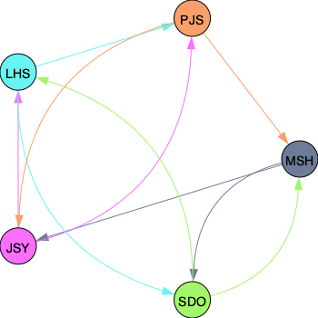
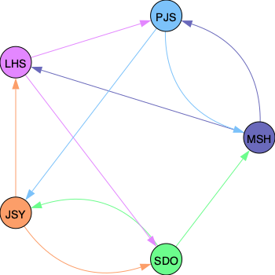

## Example





## Requirements

`conda` must be initialized for `bash` prior to the build. 

## Usage

Within the `utils/` folder, build the environment.

```bash
make build-env
```

Test the environment with

```bash
make test-env
```

If the test passes, use the cli in the following way.

```bash
conda activate ./venv
python main.py -n week_N
```

From the above example the output file will be in `./graphs/week_N.png`.

After creating the graph, delete the environment with the following command.

```bash
make clean
```
